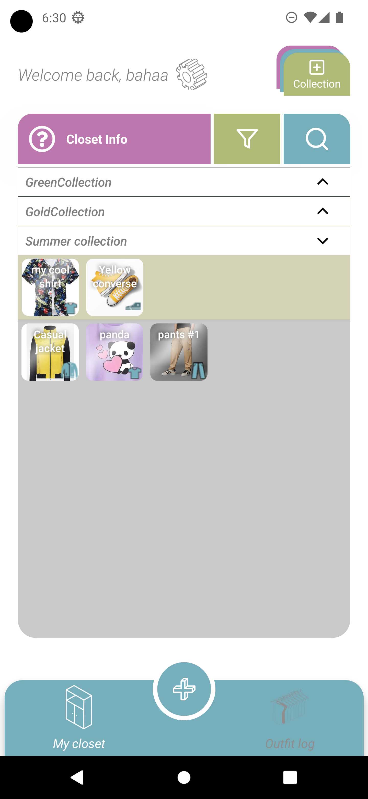

<a name="readme-top"></a>

<!-- PROJECT SHIELDS -->
<!--
*** I'm using markdown "reference style" links for readability.
*** Reference links are enclosed in brackets [ ] instead of parentheses ( ).
*** See the bottom of this document for the declaration of the reference variables
*** for contributors-url, forks-url, etc. This is an optional, concise syntax you may use.
*** https://www.markdownguide.org/basic-syntax/#reference-style-links
-->

[![Contributors][contributors-shield]][contributors-url]
[![Forks][forks-shield]][forks-url]
[![Stargazers][stars-shield]][stars-url]
[![Issues][issues-shield]][issues-url]
[![MIT License][license-shield]][license-url]
[![LinkedIn][linkedin-shield]][linkedin-url]

<!-- PROJECT LOGO -->
<!-- <br />
<div align="center">
  <a href="https://github.com/bahaaTuffaha/Project-ClosetArchive">
    
  </a>

<h3 align="center">project_title</h3>

  <p align="center">
    project_description
    <br />
    <a href="https://github.com/bahaaTuffaha/Project-ClosetArchive"><strong>Explore the docs »</strong></a>
    <br />
    <br />
    <a href="https://github.com/bahaaTuffaha/Project-ClosetArchive">View Demo</a>
    ·
    <a href="https://github.com/bahaaTuffaha/Project-ClosetArchive/graphs/contributorsissues">Report Bug</a>
    ·
    <a href="https://github.com/bahaaTuffaha/Project-ClosetArchive/graphs/contributorsissues">Request Feature</a>
  </p>
</div> -->

<!-- TABLE OF CONTENTS -->
<details>
  <summary>Table of Contents</summary>
  <ol>
    <li>
      <a href="#about-the-project">About The Project</a>
      <ul>
        <li><a href="#built-with">Built With</a></li>
      </ul>
    </li>
    <li>
      <a href="#getting-started">Getting Started</a>
      <ul>
        <li><a href="#installation">Installation</are></li>
      </ul>
    </li>
    <li><a href="#usage">Usage</a></li>
    <li><a href="#roadmap">Roadmap</a></li>
    <li><a href="#contributing">Contributing</a></li>
    <li><a href="#license">License</a></li>
    <li><a href="#contact">Contact</a></li>
    <li><a href="#acknowledgments">Acknowledgments</a></li>
  </ol>
</details>

<!-- ABOUT THE PROJECT -->

## About The Project

<!-- [![Product Name Screen Shot][product-screenshot]](https://example.com) -->

Closet-Archive is an open-source app designed to assist people in organizing, categorizing, and, most importantly, logging their recent outfit choices. This functionality prevents the inadvertent repetition of clothing items, aids in laundry management, and offers various other features.

<p align="right">(<a href="#readme-top">back to top</a>)</p>

### Built With

<div>
  <a href="https://reactnative.dev/" target="_blank" rel="noreferrer">
    
  </a>
    <a href="https://redux-toolkit.js.org/" target="_blank" rel="noreferrer">
    
  </a>
</div>

<p align="right">(<a href="#readme-top">back to top</a>)</p>

<!-- Donations -->
### Donations

<a href="https://paypal.me/BahaaTuffaha?country.x=SA&locale.x=en_US" target="_blank"></a>
<!-- GETTING STARTED -->

## Getting Started

This is an example of how you may give instructions on setting up your project locally.
To get a local copy up and running follow these simple example steps.

### Installation

installing all packages.

- npm

  ```sh
  npm install

  ```

  - then run the emulation you prefer (am focusing on android):

  ```sh
  npx react-native start

  ```

<!-- USAGE EXAMPLES -->

## Usage

[](img1.png)[](img2.png)[](img3.png)

- Adding a Clothing Item:

Press the "+" button , press on adding an item and choose your category.
Fill in the details of the clothing item, such as name, type, image or colors, and size.(min req. :name,type)
Click "Save" to add the item to your closet.

- Recording an Event:

Press the "+" button , press on adding a log then select a clothing item from your closet.
Provide event details, including the date, name, and any notes.
Click "Save" to record the event for that item.

- Managing Collections:

Create a new collection by clicking collection at main screen.

- Importing and Exporting Data:

Use the "Import" and "Export" features in the app's settings to manage your data.

<p align="right">(<a href="#readme-top">back to top</a>)</p>

<!-- ROADMAP -->

## Roadmap

- [ ] Fixing issues.
- [ ] Improving filters.
- [ ] Selecting a whole collection when logging an event.
- [ ] Adding a bulk by snapping images for a quick way.
  - [ ] color filter
  - [ ] Adding Ai to recongnize and recommend what to wear maybe later?

See the [open issues](https://github.com/bahaaTuffaha/Project-ClosetArchive/issues) for a full list of proposed features (and known issues).

<p align="right">(<a href="#readme-top">back to top</a>)</p>

<!-- CONTRIBUTING -->

## Contributing

Contributions are what make the open source community such an amazing place to learn, inspire, and create. Any contributions you make are **greatly appreciated**.

If you have a suggestion that would make this better, please fork the repo and create a pull request. You can also simply open an issue with the tag "enhancement".
Don't forget to give the project a star! Thanks again!

1. Fork the Project
2. Create your Feature Branch (`git checkout -b feature/AmazingFeature`)
3. Commit your Changes (`git commit -m 'Add some AmazingFeature'`)
4. Push to the Branch (`git push origin feature/AmazingFeature`)
5. Open a Pull Request

<p align="right">(<a href="#readme-top">back to top</a>)</p>

<!-- LICENSE -->

## License

Distributed under the MIT License. See [MIT License](License) for more information.

<p align="right">(<a href="#readme-top">back to top</a>)</p>

<!-- CONTACT -->

## Contact

Bahaa Tuffaha - bahaa.tuffaha@yahoo.com

Project Link: [https://github.com/bahaaTuffaha/Project-ClosetArchive](https://github.com/bahaaTuffaha/Project-ClosetArchive)

<p align="right">(<a href="#readme-top">back to top</a>)</p>

<!-- MARKDOWN LINKS & IMAGES -->
<!-- https://www.markdownguide.org/basic-syntax/#reference-style-links -->

[contributors-shield]: https://img.shields.io/github/contributors/bahaaTuffaha/Project-ClosetArchive.svg?style=for-the-badge
[contributors-url]: https://github.com/bahaaTuffaha/Project-ClosetArchive/graphs/contributors
[forks-shield]: https://img.shields.io/github/forks/bahaaTuffaha/Project-ClosetArchive.svg?style=for-the-badge
[forks-url]: https://github.com/bahaaTuffaha/Project-ClosetArchive/network/members
[stars-shield]: https://img.shields.io/github/stars/bahaaTuffaha/Project-ClosetArchive.svg?style=for-the-badge
[stars-url]: https://github.com/bahaaTuffaha/Project-ClosetArchive/stargazers
[issues-shield]: https://img.shields.io/github/issues/bahaaTuffaha/Project-ClosetArchive.svg?style=for-the-badge
[issues-url]: https://github.com/bahaaTuffaha/Project-ClosetArchive/issues
[license-shield]: https://img.shields.io/github/license/bahaaTuffaha/Project-ClosetArchive.svg?style=for-the-badge
[license-url]: https://github.com/bahaaTuffaha/Project-ClosetArchive/blob/master/LICENSE
[linkedin-shield]: https://img.shields.io/badge/-LinkedIn-black.svg?style=for-the-badge&logo=linkedin&colorB=555
[linkedin-url]: https://www.linkedin.com/in/bahaa-tuffaha
[product-screenshot]: images/screenshot.png
[Next.js]: https://img.shields.io/badge/next.js-000000?style=for-the-badge&logo=nextdotjs&logoColor=white
[Next-url]: https://nextjs.org/
[React.js]: https://img.shields.io/badge/React-20232A?style=for-the-badge&logo=react&logoColor=61DAFB
[React-url]: https://reactjs.org/
[Vue.js]: https://img.shields.io/badge/Vue.js-35495E?style=for-the-badge&logo=vuedotjs&logoColor=4FC08D
[Vue-url]: https://vuejs.org/
[Angular.io]: https://img.shields.io/badge/Angular-DD0031?style=for-the-badge&logo=angular&logoColor=white
[Angular-url]: https://angular.io/
[Svelte.dev]: https://img.shields.io/badge/Svelte-4A4A55?style=for-the-badge&logo=svelte&logoColor=FF3E00
[Svelte-url]: https://svelte.dev/
[Laravel.com]: https://img.shields.io/badge/Laravel-FF2D20?style=for-the-badge&logo=laravel&logoColor=white
[Laravel-url]: https://laravel.com
[Bootstrap.com]: https://img.shields.io/badge/Bootstrap-563D7C?style=for-the-badge&logo=bootstrap&logoColor=white
[Bootstrap-url]: https://getbootstrap.com
[JQuery.com]: https://img.shields.io/badge/jQuery-0769AD?style=for-the-badge&logo=jquery&logoColor=white
[JQuery-url]: https://jquery.com
